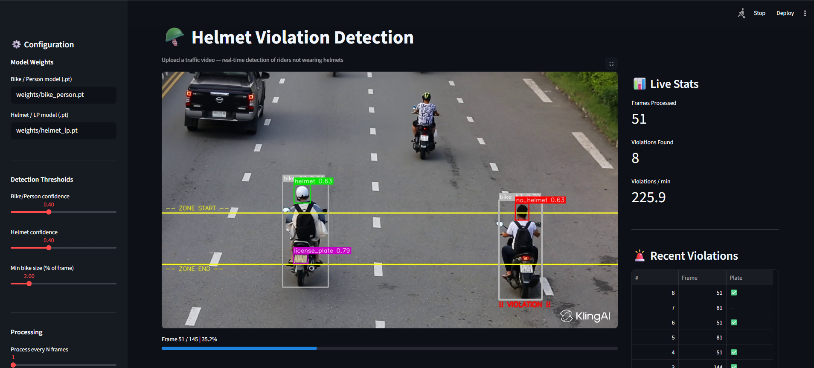

<div align="center">



# 🪖 Helmet Violation Detector

**Automated traffic surveillance powered by multi-stage YOLOv8**

[](https://python.org)
[](https://ultralytics.com)
[](https://streamlit.io)
[](LICENSE)

*Detects helmet violations in traffic video · Extracts license plates · Exports evidence*

</div>

---

## 🌍 Problem

Helmet violations are a leading cause of fatal road accidents, especially in high-density traffic. Manual monitoring is **slow, inconsistent, and unscalable**.

This project builds an end-to-end automated enforcement pipeline — detecting riders, classifying helmet usage, capturing license plates, and exporting evidence — all from a single traffic video.

---

## 💡 How It Works

```
Input Video → Bike + Rider Detection → Helmet Classification → Violation Flagging → Evidence Export
```

### Stage 1 — Bike & Rider Detection
A YOLOv8 model identifies **motorcycles** and **persons** in each frame. Only relevant regions are cropped and passed downstream.

### Stage 2 — Helmet & License Plate Detection
A second YOLOv8 model classifies each rider as:

| Class | Description |
|-------|-------------|
| ✅ `helmet` | Rider wearing a helmet |
| ❌ `no_helmet` | Rider without a helmet |
| 🔢 `license_plate` | License plate region |

### Stage 3 — Violation Logic
A violation is triggered when a rider is continuously detected **without a helmet for ≥ 1 second** inside the detection zone.

### Stage 4 — Smart Filtering
- **Size threshold** — ignores distant vehicles too small to classify reliably
- **IoU-based bike tracking** — assigns persistent IDs across frames
- **Cooldown mechanism** — prevents duplicate saves for the same bike

### Stage 5 — Evidence Generation
For every confirmed violation:
- 📸 Annotated frame saved to disk
- 🔢 Best-confidence license plate crop cached and saved
- 📋 Metadata logged (frame number, timestamp)
- 📥 CSV export available from the dashboard

---

## 📊 Model Performance

### 🚦 Bike + Person Detection

| Metric | Value |
|--------|-------|
| Precision | **0.976** |
| Recall | **0.979** |
| mAP@0.5 | **0.994** |
| mAP@0.5:0.95 | **0.839** |

> ✅ Near-perfect detection performance

### 🪖 Helmet + License Plate Detection

| Metric | Value |
|--------|-------|
| Precision | **0.921** |
| Recall | **0.927** |
| mAP@0.5 | **0.937** |
| mAP@0.5:0.95 | **0.696** |

**Class-wise mAP@0.5:**

| Class | mAP |
|-------|-----|
| License Plate | 0.871 |
| Helmet | 0.619 |
| No Helmet | 0.598 |

> ✅ Strong license plate detection  
> ⚠️ Moderate helmet classification — challenging due to occlusion, small object size & motion blur

---

## 🧠 Datasets

| Model | Dataset |
|-------|---------|
| Bike + Person | [Motobike Detection — Roboflow](https://universe.roboflow.com/cdio-zmfmj/motobike-detection) |
| Helmet + License Plate | [Helmet LP Detection — Roboflow](https://universe.roboflow.com/cdio-zmfmj/helmet-lincense-plate-detection-gevlq) |

---

## 📁 Project Structure

```
helmet_violation_detector/
│
├── app.py                  # Streamlit dashboard
├── requirements.txt
├── README.md
│
├── models/
│   ├── bike_person_detector.py
│   └── helmet_detector.py
│
├── utils/
│   ├── video_processor.py
│   ├── violation_handler.py
│   └── drawing.py
│
├── training/               # Training scripts & notebooks
├── weights/                # ← Place your .pt files here
├── assets/                 # Demo screenshots & banner
└── violations/             # Auto-generated violation evidence
```

---

## 🚀 Quickstart

### 1. Clone the repo

```bash
git clone https://github.com/your-username/helmet-violation-detector.git
cd helmet-violation-detector
```

### 2. Create a virtual environment

```bash
python -m venv venv
venv\Scripts\activate        # Windows
# source venv/bin/activate   # Linux / Mac
```

### 3. Install dependencies

```bash
pip install -r requirements.txt
```

### 4. Add model weights

Download your trained models and place them at:

```
weights/bike_person.pt
weights/helmet_lp.pt
```

### 5. Verify class names *(important)*

```python
from ultralytics import YOLO

print(YOLO("weights/bike_person.pt").names)
print(YOLO("weights/helmet_lp.pt").names)
```

If the class names differ from what the detectors expect, update:
- `models/bike_person_detector.py`
- `models/helmet_detector.py`

### 6. Run the app

```bash
streamlit run app.py
```

Open **http://localhost:8501** in your browser.

---

## ✨ Features

| Feature | Details |
|---------|---------|
| 🎯 Multi-stage detection | YOLOv8 pipeline: bikes → helmets → plates |
| 🎥 Real-time processing | Live annotated frame display during inference |
| 📸 Evidence saving | Violation frames + license plate crops |
| 🔢 LP caching | Best-confidence plate saved per bike across all frames |
| 🧠 Bike tracking | IoU-based persistent IDs, auto-cleanup on timeout |
| 🔁 Duplicate filtering | Per-bike cooldown prevents repeated saves |
| 📥 Video download | Download the fully annotated output video (H.264) |
| 📋 CSV export | One-click violation log download |
| ⚙️ Configurable | All thresholds tunable from the sidebar |

---

## 📌 Key Insights

- **Bike detection is highly reliable** — mAP@0.5 of 0.994 leaves little room for misses
- **Helmet classification is the harder problem** — small object size, occlusion, and motion blur are the main culprits
- **License plate detection is robust** — 0.871 mAP enables usable evidence in most cases
- **Modular pipeline** makes it easy to swap models or add new detection stages

---

## 🔭 Future Improvements

- [ ] OCR integration for license plate text recognition
- [ ] Night-time / low-light detection improvements
- [ ] Multi-camera tracking support
- [ ] Edge deployment for live CCTV systems
- [ ] Alert system (SMS / email on violation)

---

## 📜 License

This project is licensed under the [MIT License](LICENSE).

---

<div align="center">
  <sub>Built with YOLOv8 · Streamlit · OpenCV</sub>
</div>